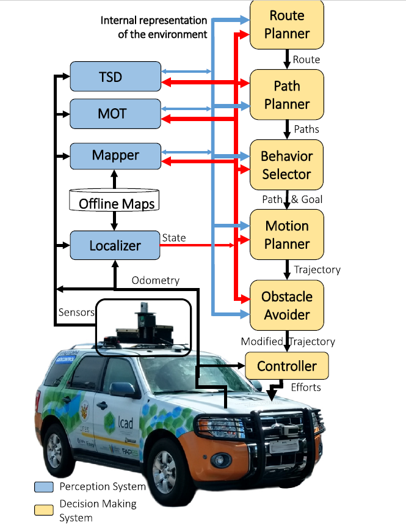

<<<<<<< HEAD
# 
Self-driving cars: A survey

1. The architecture of the autonomy system of self-driving cars is typically organized into the **perception system** and the **decision-making system**.

2. The perception system is generally divided into many subsystems responsible for task such as **self-driving-car localization**, **static obstacles mapping**, **moving obstacles detection** and **tracking**, **road mapping**, **traffic signalization detection** and **recognition**, among others.

3. The **decision-making system** is commonly partitioned as well into  many subsystems responsible for tasks such as **route planning**, **path planning**, **behavior selection**, **motion planning**, and **control**.

4. Typical architecture of self-driving cars

   

The **Perception** system is responsible for estimating the State of the car and for creating representation of the environment, using **data captured by on-board sensors**, such as Light Detection and Ranging (LIDAR), Radio Detection and Ranging (RADAR), camera, Global Positioning System (GPS), Inertial Measurement Unit (IMU), odometer, etc., and **prior information** about the sensors' models. road network. traffic rules, car dynamics, etc.

The **Decision Making** system is responsible for navigating the car from its initial position to the final goal defined by the user, considering the current car's State and the internal representation of the environment, as well as traffic rules and passengers' safety and comfort.

The **Localizer** subsystem is responsible for estimating the car's State (pose, linear velocities, angular velocities, etc.) in relation to static maps of the environment.

These static maps, or **Offline Maps**, are computed automatically before the autonomous operation, typically using the sensors of the self-driving car itself, although manual annotations (i.e., the position of pedestrian crosswalks or of traffic lights) or editions (for removing non-static objects captured by sensors) are usually required.

The **Mapper** subsystem receives as input the Offline Maps and the self-driving car's State, and generates as output the online map. This online map is typically a merge of information present in the Offline Maps and the current car's State.

The **Moving Objects Tracker** subsystem, or **MOT**, receives the Offline Maps the self-driving car's State, and detects and tracks the nearest moving obstacles.

The **Traffic Signalization Detector** subsystem, or **TSD**, is responsible for the detection and recognition of traffic signalization. It receives the Sensors' data and the car's State, and detects the position of the traffic signalizations.

Given a Final Goal defined in the Offline Maps by the user, the **Route Planner** subsystem computes a Route, **$W$**, in the offline Maps, from the current self-driving car's State to the Final Goal. A route is a sequence of way points, i.e. $W={w_1,w_2,...,w_{|W|}}$, where each way point, $w_i$, is a coordinate pair, i.e. $w_i=(x_i,y_i)$, in the Offline Maps.

The **Behavior Selector** subsystem is responsible for choosing the current driving behavior, such as lane keeping, intersection handling, traffic light handling, etc. It does so by selecting a Path, $P_j$, in $P$, a pose, $p_g$, in $P_j$ a few seconds ahead of the current self-driving car's State, which is the decision horizon, and the desired velocity at this pose. The pair pose in $P_j$ and associated velocity is called $Goal_g=(p_g, v_g)$. The **Behavior Selector** chooses a Goal considering the current driving behavior and avoiding collisions with static and moving obstacles in the environment within the decision horizon time frame.

The **Motion Planner** subsystem is responsible for computing a Trajectory, $T$, from the current self-driving car's State to the current Goal, which follows the Path defined by the Behavior Selector, satisfies car's kinematic and dynamic constraints, and provides comfort to the passengers. A Trajectory $T=\{c_1, c_2,...,c_{|T|}\}$ may be defined as a sequence of commands, $c_k = (v_k, \varphi_k, \Delta t_k)$, where $v_k$ is the desired velocity at time $k$, $\varphi_k$ is the desired steering angle at time $k$, and $\Delta_{t_k}$ is the duration of $c_k$. A Trajectory takes the car from its current State to the current Goal smoothly and safely.

The **Obstacle Avoider** subsystem receives the Trajectory computed by the Motion Planner and change it (typically reducing the velocity), if necessary, to avoid collisions.

The **Controller** subsystem receives the Motion planner trajectory, eventually modified by the Obstacle Avoider subsystem, and computes and sends Effort commands to the actuators of the steering wheel,  throttle and brakes in order to make the car execute the Modified Trajectory as best as the physical world allows.

5. Self-driving car's perception
   1. Localization
      - LIDAR-based localization
      - LIDAR plus camera-based localization
      - Camera-based localization
   2. Offline and  online mapping of unstructured environments
   3. Road mapping
   4. Moving Objects Tracking
   5. Traffic Signalization Detection

6. Self-driving car's decision making

   1. Route planning

      The **Route Planner** subsystem is responsible for computing a route, $W$, through a road network, from the self-driving car's initial position to the final position defined by a user operator. 

      A Route is a sequence of way points, i.e. $W=\{w_1, w_2, ...,w_{|W|}\}$, where each way point, $w_i$, is a coordinate pair, i.e. $w_i=(x_i, y_i)$, in the Offline Maps.

      If the road network is represented by a weighted directed graph, whose vertices are way points, edges connect pairs of way points, and edge weights denote the cost of traversing a road segment defined by two way points, then the problem of computing a route can be reduced to the problem of finding the shortest path in a weight directed graph.

      Techniques for route planning in road networks provide different trade-offs in terms of query time, preprocessing time, space usage, and robustness to input change, among other factors. Such techniques can be categorized into four classes:

      - Goal-directed techniques
        - Goal-directed techniques guide the search from the source vertex to the target vertex by avoiding scans of vertices that are not in the direction of the target vertex.
          - $A^*$
          - Dijkstra
          - Landmarks, and Triangle inequality (ALT) algorithm
          - Arc Flags
      - Separator-based techniques
        - Separator-based techniques are based on either vertex or arc separators. A vertex (or arc) separator is a small subset of vertices (or arcs) whose removal decomposes the graph into several balanced cells.
        - The vertex separator-based algorithm uses vertex separators to computer an overlay graph. Shortcut arcs are added to the overlay graph such distances between any pair of vertices from the full graph and is used to accelerate the query algorithm.
          - High-Performance Multilevel Routing (HPML) algorithm
        - The arc separator-based algorithm uses arc separators to decompose the graph into balanced cells, attempting to minimize the number of cut arcs, which connect boundary vertices of different cells.
        - Shortcuts are added to the overlay graph in order to preserve distance between boundary vertices within each cell.
          - Customizable Route Planning (CRP) algorithm
      - Hierarchical techniques
        - Hierarchical techniques exploit the inherent hierarchy of road networks, in which main roads such as highways compound a small arterial subnetwork. When the source and target vertices are distant, the query algorithm only scans vertices of the subnetworks.
        - The preprocessing phase computes the importance of vertices or arcs according to the actual shortest path structure.
          - Contraction Hierarchies (CH) algorithm
          - REACH algorithm
      - Bounded-hop techniques
        - Bounded-hop techniques precompute distances between pairs of vertices by adding virtual shortcuts to the graph. Since precomputing distances among all pairs of vertices is prohibitive for large networks, bounded-hop techniques aim to get the length of any virtual path with very few hops.
          - Hub Labeling (HL)
          - $HL-\infty$ algorithm
          - Hub Label Compression
          - Transit Node Routing (TNR)
      - Combinations
        - Individual techniques can be combined into hybrid algorithms that exploit different graph properties.
          - REAL algorithm combines REACH and ALT
          - ReachFlags algorithm combines REACH and Arc Flags
          - SHARC algorithm combines the computation of shortcuts with multilevel Arc Flags.
          - CHASE algorithm combines CH with Arc Flags
          - TNR+AF algorithm
          - The PHAST algorithm 

   2. Path planning

      - The **Path Planner** subsystem computes a set of Paths, $=\{P_1, P_2,...,P_{|P|}\}$, considering the current route, the self-driving car's State, the internal representation of the environment, as well as traffic rules.

      - A Path $P_j=\{p_1, p_2, ..., p_{|P|}\}$ is a sequence poses $p_i=(x_i, y_i, \theta_i)$, which are car positions and respective orientations in the Offline Maps.
      - Methods for path planning can be mainly categorized into two classes: **graph search based** and **interpolating curve based**.
      - Graph search based techniques
        - Graph search based techniques searched for the best paths between car's current state and a goal state in a state space represented as a graph.
        - The goal state is a pose near a way point $w_i$ of the current route $W$.
        - These techniques discretize the search space imposing a graph on a occupancy grid map with centers of cells acting as neighbors in the search graph.
        - The most common graph search based techniques for path planning of self-driving cars are Dijkstra, A-star, and A-star variants.
      - Interpolating curve based techniques
        - Interpolating curve based techniques take a previously known set of points and generate a new set of points the depicts a smooth path.
        - The most usual interpolating curve based techniques for path planning of self-driving cars are spline curves.

   3. Behavior selection

      - The **Behavior Selector** subsystem is responsible for choosing the current driving behavior, such as lane keeping, intersection handling, traffic light handling, etc., by selecting a Path, $P_j$, in $P$, a pose, $p_g$, in $P_j$, and the desired velocity at this pose. 
      - The pair $p_g$ and associated velocity is called a $Goal_g=(p_g, v_g)$.
      - The estimated time between the current state and the $Goal_g$ is the *decision horizon*.
      - The Behavior Selector chooses a Goal considering the current driving behavior and avoiding collisions with static and moving obstacles in the environment within the decision horizon time frame.

>>>>>>> cbf0954b346c8b0eb314cdac0dfe6180f9a73275
